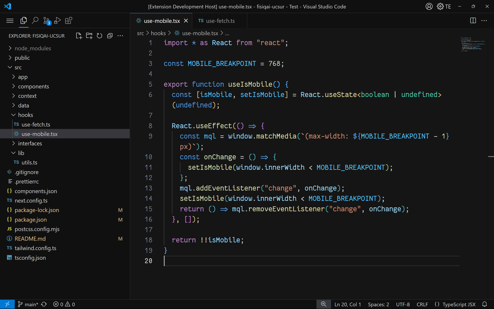
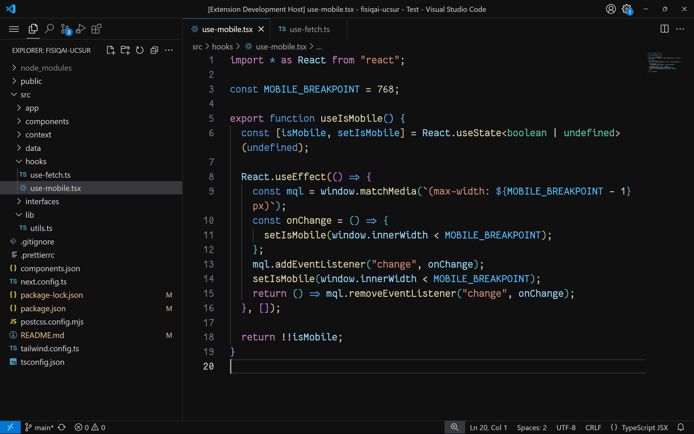
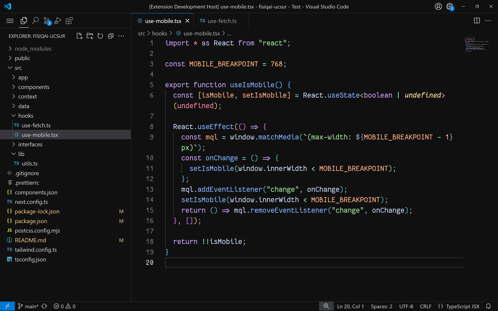
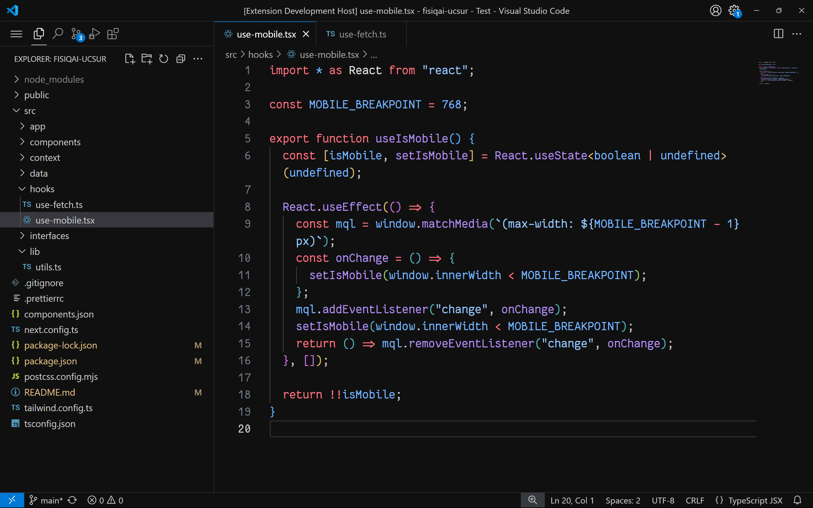
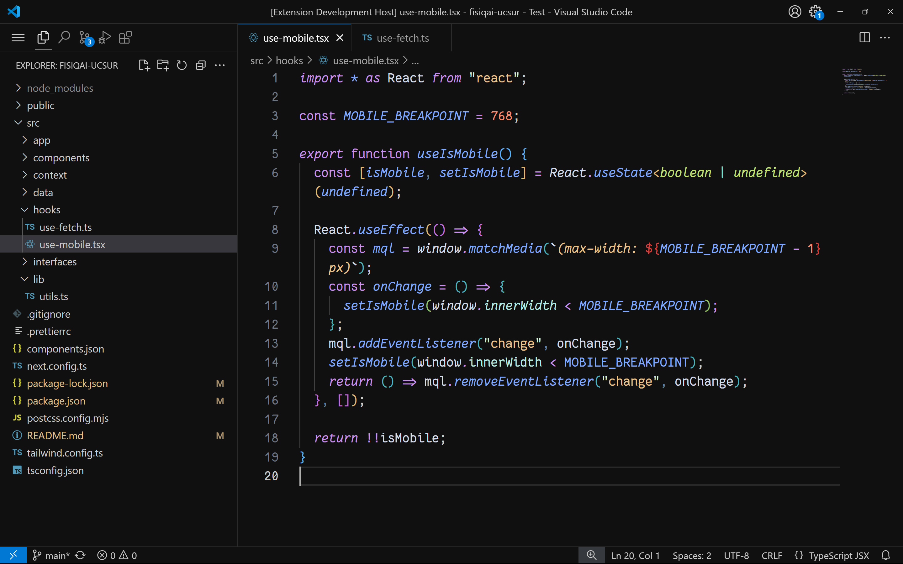
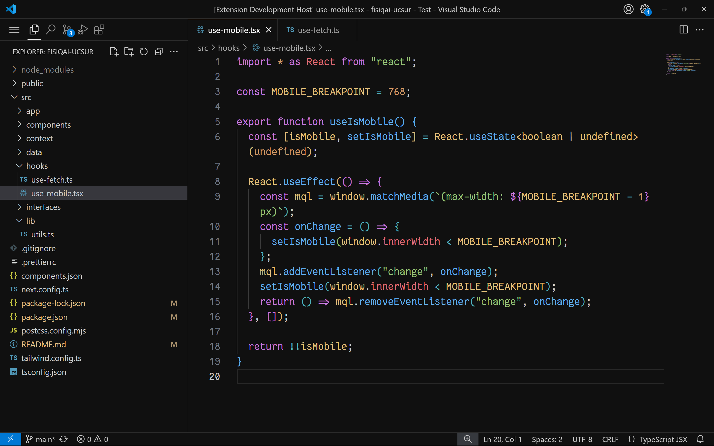

# Pichon Theme

Pichon Theme is a darker and more refined version of the default VS Code theme (Dark Modern). Its interface retains the original essence but with improved contrast for a more pleasant visual experience.

The code colors are inspired by popular themes like:
- Dark Modern
- GitHub Theme
- Catppuccin for VSCode
- One Dark Pro
- Night Owl

## 🚀 Features

- **Enhanced dark interface**: Based on Dark Modern, but with deeper and more balanced tones.
- **Refined code colors**: Inspired by some of the most popular community themes.
- **Easy to use**: Maintains the essence of the original VS Code theme with a more visually pleasing adjustment.
- **Two styles**: With "Pichon One" the editor color matches the sidebar.

## 📸 Screenshots

### Pichon Core

### Pichon One

  

    Variants
  

  #### Catppuccin
  
  
  #### Github 
  
  
  #### Night Owl 
  
  
  #### One dark
  
  

## 🔨 Installation

1. Open **Visual Studio Code**.
2. Go to the **Extensions** tab (`Ctrl + Shift + X`).
3. Search for **"Pichon Theme"**.
4. Click **Install**.
5. Activate the theme in: `Preferences > Color Theme > Pichon Theme`.

## 🫶 Contribute

If you have suggestions or improvements, feel free to open an issue or submit a pull request on the repository.

## 📜 License

This theme is available under the MIT license.
